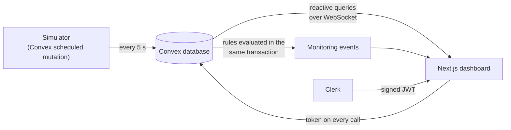

# Post-PCI Watch

A synthetic remote-monitoring dashboard for a fictional patient after percutaneous coronary
intervention (PCI), built with **Next.js**, **Clerk**, and **Convex**.

A simulated wearable sends readings into Convex, Convex keeps every open dashboard synchronised
in real time, Clerk controls who is signed in, and explicit software rules flag noteworthy events.

> **Synthetic data only.** Every patient, reading, and event is fabricated. This is a learning and
> portfolio project: not a medical device, no medical advice, no diagnosis, and no HIPAA
> compliance claim.

**Live demo:** _URL to be added after the production deployment is confirmed on a second device._

---

## How it works



1. **A synthetic wearable produces readings.** `convex/simulator.ts` runs on Convex's scheduler:
   each tick advances a simple activity-state model (`RESTING`, `WALKING`, `SLEEPING`,
   `RECOVERY`) and writes heart rate, SpO₂, and respiratory rate. Sessions stop themselves after
   15 minutes.
2. **Every reading carries provenance.** Origin, source, observation time, and ingestion time are
   set by the server — a browser can name a patient, never who it is or where data came from.
3. **The dashboard updates without refreshing.** `useQuery` subscriptions rerun on the server
   when their data changes and push the new result to every client.
4. **Authentication and authorization are separate.** Clerk proves identity; every public Convex
   function checks that the caller owns the record it touches. The simulator's tick is an
   internal function no client can call.
5. **Deterministic rules flag events.** Versioned rules (`rules-v1`) open, extend, and close
   episodes in the same transaction that stores each reading. The thresholds are demo
   configuration, not clinical limits.

An append-only activity history records successful writes and workspace access, written
atomically with the action it describes.

## What is built, and what is not

| Built | Not built (out of scope for this version) |
| --- | --- |
| Clerk sign-in and route protection | AI summaries and clinician review workflow |
| Per-record ownership checks in Convex | PhysioNet data, synthetic clinical context |
| Server-side simulator with auto-stop | Automated test suite |
| Live vitals, 5-minute and 1-hour windows with trends | Roles, organisations, clinician assignments |
| Deterministic event rules | Clerk production instance on an owned domain |
| Append-only activity history | |
| Vercel + Convex production deployment | |

Security findings and their status are tracked honestly in
[`docs/security/SECURITY_POSTURE.md`](docs/security/SECURITY_POSTURE.md).

## Running locally

Requirements: Node.js 20+, a Clerk application with a JWT template named `convex`, and a Convex
account.

```bash
npm install
cp .env.example .env.local        # fill in the Clerk values
npx convex dev                    # creates a dev deployment and writes the Convex URLs
npx convex env set CLERK_FRONTEND_API_URL https://<your-clerk-frontend-api>
npm run dev                       # in a second terminal
```

Open http://localhost:3000, sign in, create the demo patient, and start the simulator.

## Deployment

Vercel builds with `npx convex deploy --cmd 'npm run build'` (see `vercel.json`), which builds the
Next.js app against the production Convex URL and then pushes the Convex functions. The full
runbook — which variable lives where, and why — is
[`docs/concepts/phase-16-deployment.md`](docs/concepts/phase-16-deployment.md).

## Documentation

- [`docs/PROJECT_SOURCE.md`](docs/PROJECT_SOURCE.md) — the project contract and roadmap
- [`docs/PHASE_LOG.md`](docs/PHASE_LOG.md) — what each phase built and how it was verified
- [`docs/concepts/`](docs/concepts/) — one reference per phase explaining why the code is shaped
  the way it is
- `/learn` in the running app — an interactive teaching library
