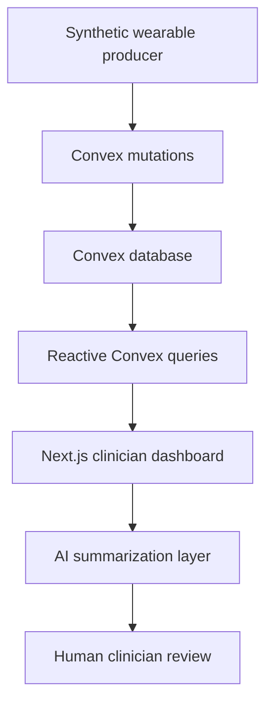

# Post-PCI Watch

## Project Source and Teaching Contract

Post-PCI Watch is a small, synthetic remote-monitoring application for a hypothetical patient after percutaneous coronary intervention (PCI).

This is primarily a **teaching project**. The finished application matters, but the main goal is to deeply understand this stack:

- Next.js
- TypeScript
- Clerk
- Convex
- Vercel
- Later: AI integration
- Later: external clinical and research data sources such as PhysioNet and Synthea

> **Do not build the entire application in one pass.**

The learner is an experienced clinical vascular technologist who is learning software engineering. They already understand React, APIs, authentication concepts, databases, and backend architecture reasonably well. The purpose of this project is to learn the Next.js, Clerk, and Convex ecosystem from first principles and be able to explain every important architectural decision.

---

## Product Concept

The application will eventually simulate wearable monitoring data such as:

- Heart rate
- SpO2
- Respiratory rate
- Activity
- Posture
- Skin temperature
- ECG waveform data

The dashboard will update in real time. Later, an AI system will summarize the patient's synthetic monitoring timeline for clinician review.

### Educational and Clinical Safety Boundaries

- Use synthetic data only.
- Never use real patient data.
- Do not build diagnostic functionality.
- Do not claim that the application provides medical advice.
- Do not design the AI to diagnose disease independently.
- Preserve human clinician review for AI-generated summaries.

---

## Target Architecture



### Technology Responsibilities

| Technology | Responsibility |
| --- | --- |
| Clerk | Authentication, sessions, and user identity |
| Convex | Backend functions, persistence, authorization enforcement, and reactive data synchronization |
| Next.js | Web application, routing, rendering, and clinician-facing interface |
| Vercel | Eventual web application hosting and deployment |
| AI provider | Eventual structured summarization of grounded monitoring data |

---

## Learning Contract

Build the project progressively. Do not hide important concepts behind generated code.

Before introducing a technology or architectural feature, explain:

1. What problem it solves.
2. Where it runs.
3. What communicates with it.
4. What data crosses the boundary.
5. What code is about to be written.
6. Why that code belongs where it does.
7. What would happen if that piece did not exist.

The learner should understand a system flow before implementation continues. For example:

```text
Browser
→ Next.js
→ Clerk identity
→ Convex client
→ Convex query or mutation
→ Convex database
→ Reactive subscription
→ UI rerender
```

Do not say that a feature “works automatically” without explaining the mechanism. When Convex, Clerk, Next.js, or Vercel abstracts infrastructure or behavior, explain what is being abstracted.

---

## Required Learning Topics

### Next.js

- App Router
- The `app/` directory
- Layouts
- Pages
- Server Components
- Client Components
- The `"use client"` directive
- Server execution versus browser execution
- Routing
- Loading and error states
- Environment variables
- API and HTTP routes when they are appropriate
- Deployment to Vercel

### Clerk

- Authentication versus authorization
- Users
- Sessions
- Cookies
- Tokens
- JWTs
- Protected routes
- Middleware
- Server-side authentication
- Client-side authentication
- How Clerk identity reaches Convex
- Trust boundaries

### Convex

- What Convex is
- Projects and deployments
- Schema
- Tables
- Documents
- Document IDs
- Indexes
- Queries
- Mutations
- Actions
- Internal functions when appropriate
- Validators
- Authentication context
- Authorization checks
- Realtime and reactive queries
- Optimistic UI when appropriate
- Transactions and atomic behavior
- Scheduled functions when appropriate
- External API calls
- Error handling

### Realtime Systems

- Subscriptions
- Persistent connections
- WebSockets
- Why a developer normally does not manage the socket manually with Convex
- Producer and consumer architecture
- Events versus current state
- Timestamps
- Sampling frequency
- Batching
- Backpressure at a conceptual level
- Reconnection behavior
- Stale data versus live data

### Clinical Data

- Synthetic data versus real patient data
- Time-series observations
- Waveform data versus discrete measurements
- Provenance
- Observation and ingestion timestamps
- Units
- Source and device identity
- Keeping clinical facts separate from AI-generated interpretation

### AI Integration

- Convex actions for external model calls
- Server-side secrets
- Structured outputs
- Grounding
- Provenance
- Deterministic data versus AI interpretation
- Human-in-the-loop review
- Hallucination boundaries
- Auditability

### Security

- Never trust browser-supplied identity
- Authentication versus authorization
- Object ownership
- Protecting Convex functions
- Secret management
- Environment separation
- Least privilege
- Development configuration versus production configuration

### Testing

- Unit-level testing where appropriate
- Testing Convex functions
- Testing authorization
- Testing ownership boundaries
- Testing the simulator
- Testing failure states
- Testing AI structured-output validation

---

## Development Rules

- Do not prematurely add libraries, abstractions, design systems, state managers, or infrastructure.
- Prefer the native capabilities of Next.js, Clerk, and Convex.
- Do not wrap Convex unnecessarily merely to imitate REST architecture.
- Teach and use the Convex way of building applications.
- Use TypeScript throughout.
- Prefer readable code over clever code.
- Keep functions and components small enough to understand.
- Introduce complexity only when the current phase requires it.
- Stop at the end of each phase until the learner demonstrates understanding.

Whenever a file is created or updated, show its full project-relative filename above the code:

```tsx
// # Filename: src/components/dashboard/PatientOverview.tsx
```

Use execution comments only when they materially help:

```ts
// Step 1:
// Step 2:
```

Do not litter obvious code with comments.

---

## Learning Roadmap

### Phase 1 — Next.js Foundation

Build only a static Post-PCI Watch clinician dashboard.

Learn:

- Next.js project structure
- App Router
- Layouts
- Pages
- Server Components
- Client Components
- Component composition

Do not add Clerk, Convex, a database, or AI.

### Phase 2 — Clerk Authentication

Add:

- Sign-in
- Sign-out
- An authenticated dashboard
- A protected route

Learn exactly how authentication flows through the application.

### Phase 3 — Convex Foundation

Add Convex. Start with one manually created synthetic patient and a small set of simple measurements.

Learn:

- Schema
- Queries
- Mutations
- Validators
- Convex dashboard and deployments
- Client provider
- Reactive queries

### Phase 4 — Clerk and Convex Identity

Connect authenticated Clerk users to Convex.

Learn:

- Identity propagation
- Authentication context
- Server trust
- Ownership
- Authorization

Create at least two users and verify that one user cannot access another user's protected data.

### Phase 5 — Realtime Data

Create one changing synthetic value, initially heart rate. The UI should update reactively through Convex.

Before building the simulator, explain:

- Subscription
- WebSocket
- Reactive query
- Mutation
- UI rerender

### Phase 6 — Synthetic Wearable Simulator

Build a simple producer for:

- Heart rate
- SpO2
- Respiratory rate
- Activity state

Do not generate values through unrestricted randomness. Use simple, physiologically plausible transitions between states such as:

- `RESTING`
- `WALKING`
- `SLEEPING`
- `RECOVERY`

Each state may produce values from different configured ranges. The simulator exists to test software architecture; it is not a validated physiological model.

### Phase 7 — Time-Series Architecture

Model measurement history with:

- Observation timestamp
- Ingestion timestamp
- Measurement type
- Value
- Unit
- Source
- Patient association
- Appropriate indexes
- Query windows

Add these views:

- Last 5 minutes
- Last hour
- Current status

### Phase 8 — PhysioNet

Only after the simulator works, investigate a small public waveform dataset from PhysioNet.

Before implementation, explain:

- File format
- Sample rate
- Channels and leads
- Waveform samples
- Metadata

Then create a small replay mechanism that presents historical ECG data as an incoming stream.

### Phase 9 — Synthetic Clinical Context

Investigate Synthea and use synthetic demographic or clinical context only where it adds value. Keep wearable observations and patient context logically separate.

### Phase 10 — Deterministic Event Detection

Implement explicit software rules for noteworthy events, such as:

- Heart rate exceeds a configured threshold.
- SpO2 remains below a configured threshold for a defined interval.
- No wearable measurements have arrived recently.

These are deterministic software events, not AI conclusions.

### Phase 11 — AI Integration

Call an AI model through a Convex action.

Provide the model with:

```text
Structured synthetic patient context
+ Deterministically derived monitoring events
+ Selected time-series summary
```

Require a structured clinician-facing summary as output. The AI should summarize and organize information; it must not become the source of truth for measurements or deterministic alerts.

### Phase 12 — Grounding and Provenance

Make every AI statement about monitoring data traceable to the underlying measurements or deterministic events. Teach how the data contract preserves this traceability.

### Phase 13 — Human Review

Use review states such as:

- `DRAFT`
- `REVIEWED`
- `ACCEPTED`
- `REJECTED`

AI output must remain a draft until a human reviews it.

### Phase 14 — Failure Modes

Intentionally test:

- Clerk is unavailable.
- Convex is unavailable.
- The network connection is interrupted.
- The simulator stops sending data.
- A malformed measurement arrives.
- The AI provider times out.
- The AI returns invalid output.

For every scenario, explain what failed, where it failed, and what the user should see.

### Phase 15 — Testing

Build meaningful automated tests around the application's important boundaries, authorization rules, simulation behavior, and failure cases.

### Phase 16 — Production and Deployment

Deploy with Vercel, Clerk, and Convex.

Teach:

- Environments
- Secrets
- Development
- Preview deployments
- Production
- Deployment boundaries

### Phase 17 — Demo Polish

Polish the product only after its architecture works. The final demo should communicate this story quickly:

> A synthetic post-PCI wearable sends measurements into Convex. Convex keeps the dashboard synchronized in real time. Clerk controls authenticated access. Deterministic software identifies important monitoring events. An AI layer converts the timeline into a structured clinician-review draft while keeping the original measurements as the source of truth.

---

## Current Scope: Phase 1 Only

> **Stop after completing Phase 1. Do not proceed automatically to Clerk.**

Do not install or add:

- Clerk
- Convex
- AI
- PhysioNet
- Synthea

### Phase 1 Tasks

1. Inspect the current repository, if one exists.
2. Recommend the exact Next.js initialization command if initialization is necessary.
3. Explain every important option in that command.
4. Propose a very small project structure.
5. Explain Server Components and Client Components before using them.
6. Build a static clinician dashboard with hardcoded synthetic information.
7. Make the interface polished enough to look like the foundation of a real clinical-monitoring product.
8. Avoid overengineering.
9. Explain the request and render flow after implementation.
10. End with a short mastery check.

### Required Phase 1 Mastery Check

Ask the learner to explain this flow in their own words:

```text
Browser
→ Next.js
→ layout
→ page
→ components
→ rendered dashboard
```

Then ask:

1. Which code ran on the server?
2. Which code ran in the browser?
3. Why did each part run there?
4. What would force a component to become a Client Component?

Proceed to Phase 2 only after the learner understands and can explain these answers.
